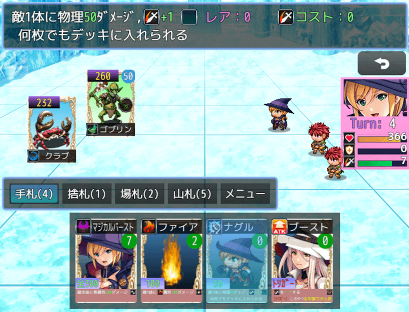
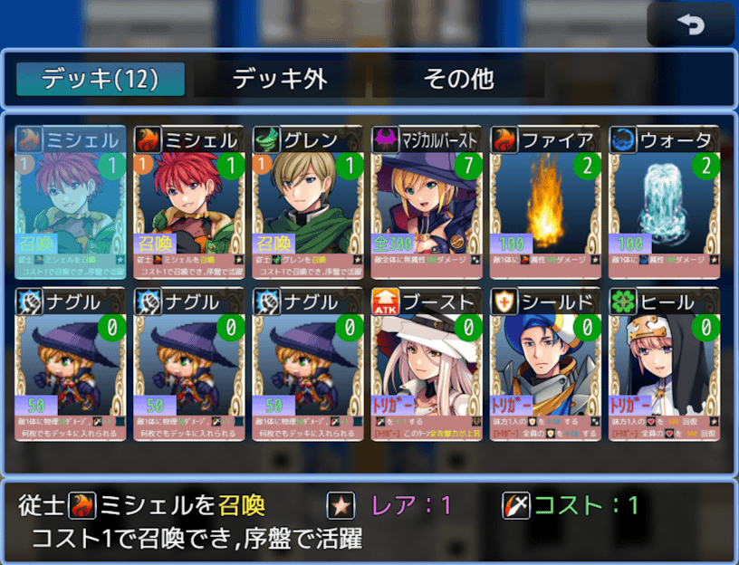

# カードゲームMZサンプル３
### RPGツクールMZ専用のプロジェクトです

カードゲームを作りたいけど、どうやって作っていいか分からない方、  
自分の描いたイラストをゲームにしてみたい方などへ、  
デッキ構築型カードゲームのサンプルプロジェクトを作ってみました  

PLiCy「カード使いのケイシー３」にて、ブラウザ版の [テストプレイができます](https://plicy.net/GamePlay/214119)

### 付属の以下の自作プラグインのサンプルプロジェクトを兼ねています

　[NLM_CardGameMZ.js（MZ用カードゲーム・プラグイン）](https://github.com/nolimits-tukool/NLM_CardGameMZ)  
　　→　カードゲームのシステム管理、プラグインコマンドで制御

　[NLM_CardLayoutMZ.js（MZ用カードレイアウト・プラグイン）](https://github.com/nolimits-tukool/NLM_CardLayoutMZ)  
　　→　カード絵のレイアウト作成、敵カード化、ピクチャ制御

　[NLM_ItemToSummon.js（召喚アイテム・プラグイン）](https://github.com/nolimits-tukool/NLM_ItemToSummon)  
　　→　アイテムによる召喚システムを機能追加

　[NLM_AnotherBattleStatusMZ.js（戦闘ステータス追加プラグイン)](https://github.com/nolimits-tukool/NLM_AnotherBattleStatusMZ)  
　　→　戦闘入力時に右横の顔付きステータスを追加

### 「カードゲームMZサンプル３」（4つのプラグイン入り）を [download](https://github.com/nolimits-tukool/CardGameMZSample3/raw/refs/heads/main/CardMZSample3.zip)  
　　RPGツクールMZ専用プロジェクトです  
　　download解凍後は「readme.txt」に利用方法が書いてあります

---

プログラムについて未熟な私が JavaScript を一から勉強して作ったものなので、  
不備な点も多くあると思います  
ご理解いただける方のみ、利用して下さい

## [リポジトリ一覧へ](https://github.com/nolimits-tukool?tab=repositories)
