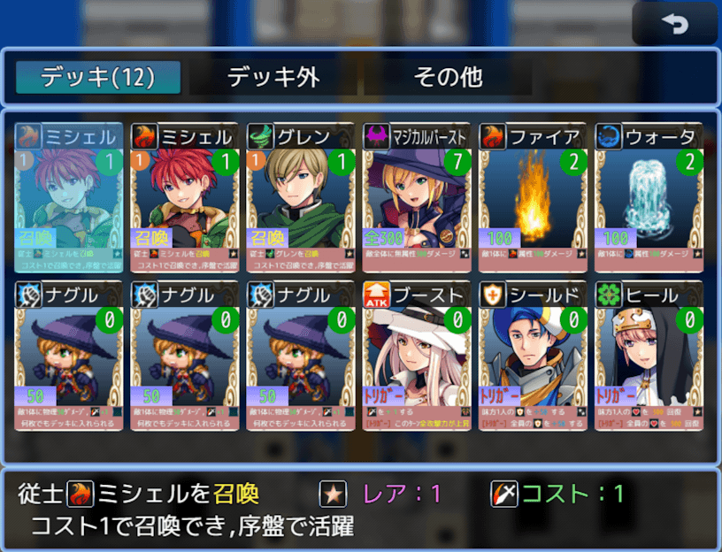

# カードゲームMZサンプル３
### RPGツクールMZ専用のプロジェクトです （2026/5/1 バージョンアップ）

カードゲームを作りたいけど、どうやって作っていいか分からない方、  
自分の描いたイラストをゲームにしてみたい方などへ、  
デッキ構築型カードゲームのサンプルプロジェクトを作ってみました  

PLiCy「カード使いのケイシー３」にて、ブラウザ版の [テストプレイができます](https://plicy.net/GamePlay/214119)

### 付属の以下の自作プラグインのサンプルプロジェクトを兼ねています

　[NLM_CardGameMZ.js（MZ用カードゲーム・プラグイン）](https://github.com/nolimits-tukool/NLM_CardGameMZ)  
　　→　カードゲームのシステム管理、プラグインコマンドで制御

　[NLM_CardLayoutMZ.js（MZ用カードレイアウト・プラグイン）](https://github.com/nolimits-tukool/NLM_CardLayoutMZ)  
　　→　カード絵のレイアウト作成、敵カード化、ピクチャ制御

　[NLM_ItemToSummon.js（召喚アイテム・プラグイン）](https://github.com/nolimits-tukool/NLM_ItemToSummon)  
　　→　アイテムによる召喚システムを機能追加

　[NLM_AnotherBattleStatusMZ.js（戦闘ステータス追加プラグイン)](https://github.com/nolimits-tukool/NLM_AnotherBattleStatusMZ)  
　　→　戦闘入力時に右横の顔付きステータスを追加

　[NLM_CardEasyInput.js（カード簡易入力プラグイン）](https://github.com/nolimits-tukool/NLM_CardEasyInput) （v3.1～）  
　　→　 各プラグインのメモ欄入力を簡易的に補助代行

### 「カードゲームMZサンプル３」（5つのプラグイン入り）を [download](https://github.com/nolimits-tukool/CardGameMZSample3/raw/refs/heads/main/CardMZSample3.zip)  
- RPGツクールMZ専用プロジェクトです
- download解凍後は「readme.txt」に利用方法が書いてあります
- 本プロジェクトのデータを土台として改変し、自作ゲーム作品を完成させるのも問題ありません
- Windows11の[「スマートアプリコントロール」でブロックされる場合はこちら](https://github.com/nolimits-tukool/HandlingSmartAppControl)
---

### 現在のバージョン： v3.1.0 (2026/05/01)

- 全プラグインのバージョンアップ（主にHDLayout.js対策）と [カード簡易入力プラグイン](https://github.com/nolimits-tukool/NLM_CardEasyInput) の新規追加
- 座標入力コモンイベント追加（ゲーム内容には大きな変更はありません）

### 本サンプルをHD画面ノンフィールド型に改良した [「カードゲームMZサンプル3R」](https://github.com/nolimits-tukool/CardGameMZSample3R) も公開中です

## [リポジトリ一覧へ](https://github.com/nolimits-tukool?tab=repositories)
